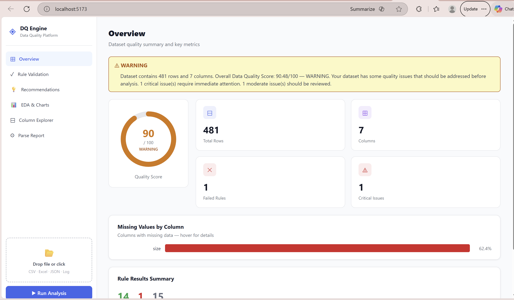
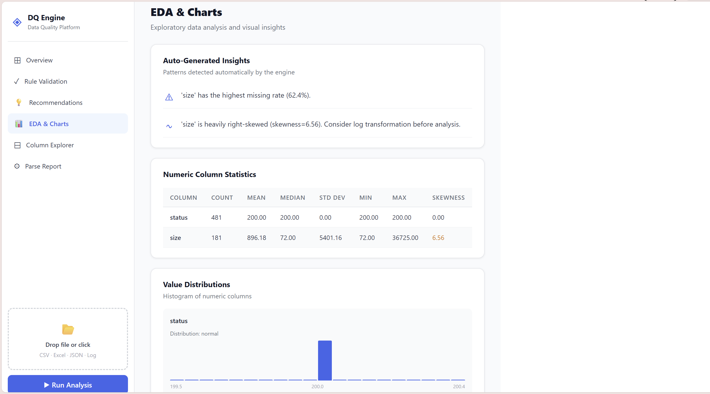
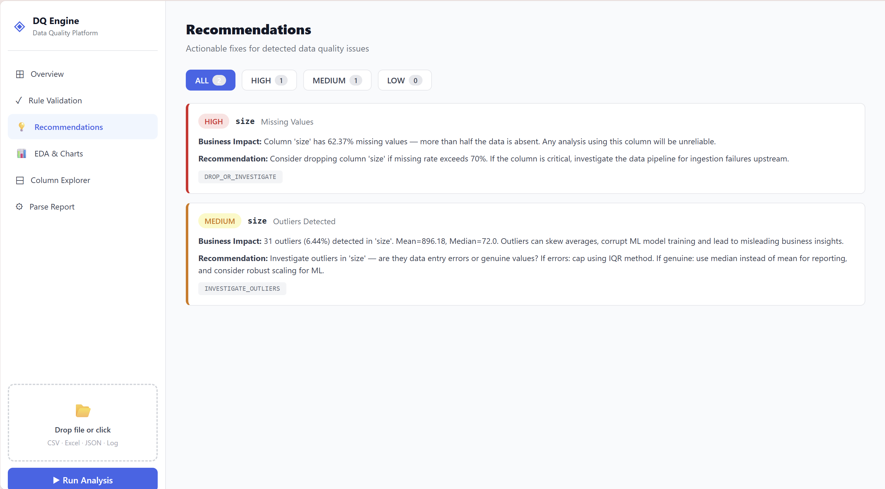
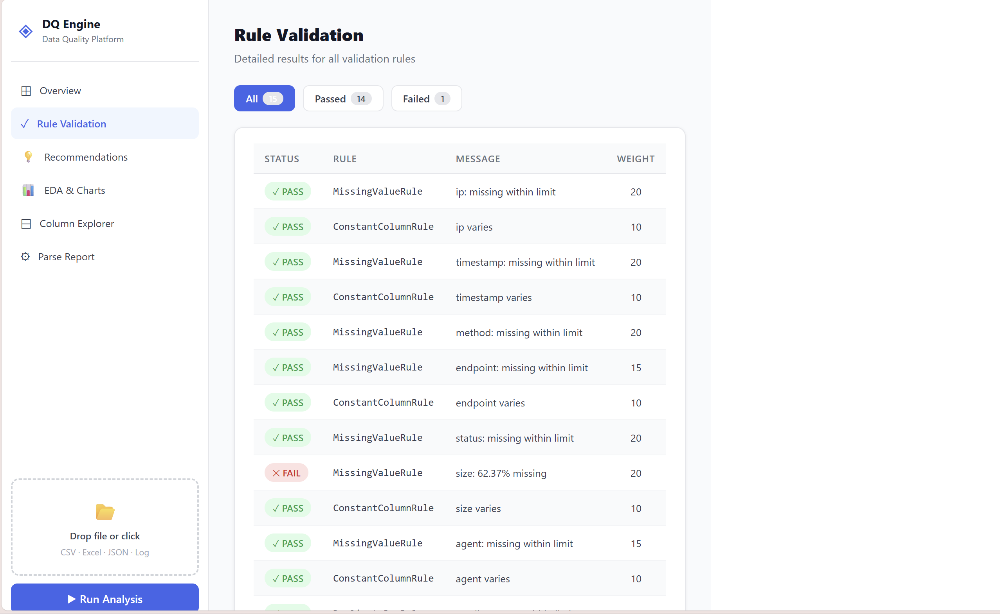

# ◈ Data Quality Engine

> Automated data quality profiling, validation, scoring and EDA — for any dataset, any format.


---

## The Problem

Organisations make critical decisions based on data — but most have no systematic way to verify data quality before analysis. Manual checking is slow, inconsistent and misses context. Enterprise tools like Informatica and Talend cost lakhs and require dedicated teams.

**The gap:** Small and mid-sized teams need automated, instant data quality assessment — without the complexity or cost.

> IBM estimates bad data costs the US economy **$3.1 trillion per year**. Poor data quality causes wrong inventory decisions, patient misdiagnoses, undetected fraud and failed ML models.

---

## What This Does

Upload any dataset — CSV, Excel, JSON, or log file — and get an instant, comprehensive quality report in seconds.

The engine automatically:
- Detects file format, encoding and delimiter
- Profiles every column (missing values, distributions, types)
- Infers schema and semantic types (email, IP address, timestamp, HTTP status...)
- Generates and evaluates validation rules dynamically
- Scores the dataset from 0–100 with weighted rules
- Runs exploratory data analysis (correlations, outliers, distributions)
- Generates actionable, business-friendly recommendations
- Produces a natural language summary

---

## Architecture

```
data-quality-engine/
├── backend/
│   ├── main.py                  ← FastAPI server (4 endpoints)
│   └── dq_engine/
│       ├── smart_loader.py      ← Intelligent file parser
│       ├── profiler.py          ← Column-level statistics
│       ├── schema.py            ← Semantic type inference
│       ├── rule_factory.py      ← Dynamic rule generation
│       ├── rules.py             ← Rule implementations
│       ├── scorer.py            ← Weighted quality scoring
│       ├── eda.py               ← Exploratory data analysis
│       ├── recommendations.py   ← Actionable fix generator
│       ├── report.py            ← Report compilation
│       ├── pipeline.py          ← Main orchestration
│       └── sql_loader.py        ← SQLite / PostgreSQL connector
├── frontend/
│   └── src/
│       └── App.jsx              ← React dashboard
└── data/
    └── *.csv                    ← Sample datasets
```

### Pipeline Flow

```
File Upload → Smart Loader → Profiler → Schema Detector
    → Rule Factory → Rule Evaluator → Scorer
    → EDA Analyzer → Recommendation Engine
    → Natural Language Summary → JSON Report → Dashboard
```

---

## Key Features

### Smart Loader
Automatically detects and handles any file format:
- **Format detection** — CSV, TSV, PSV, JSON, Excel, Apache logs, Nginx logs, Syslog
- **Encoding detection** — uses `chardet` with fallback chain
- **Excel artifact handling** — strips outer quotes added by Excel when saving log files
- **Junk line filtering** — skips separators, comments, metadata headers
- **Large file handling** — intelligent sampling for files over 50MB (first/mid/last 10%)
- **Mid-file encoding errors** — replaces corrupted bytes with NaN, never silently drops rows
- **Data freshness check** — detects stale data using timestamp columns

### Dynamic Rule Engine
Rules are generated based on the schema and profile of each dataset — not hardcoded:

| Rule | Description | Weight |
|------|-------------|--------|
| MissingValueRule | Flags columns with missing values above threshold | 15 |
| DuplicateRowRule | Detects duplicate rows | 15 |
| ConstantColumnRule | Flags columns with zero variance | 10 |
| OutlierRule | IQR-based outlier detection | 10 |
| SchemaConsistencyRule | Mixed data types in same column | 15 |
| EmailFormatRule | Invalid email format percentage | 10 |
| IPAddressRule | Invalid IP address format | 10 |
| TimestampConsistencyRule | Unparseable timestamps | 10 |
| TrafficVolumeRule | Minimum row count validation | 5 |

Rules are domain-aware — HTTP status columns being constant (all 200s) is not flagged as a data quality issue because it indicates a healthy server.

### EDA Module
- Numeric summary (mean, median, std, IQR, skewness, kurtosis)
- Pearson correlation matrix with strong pair detection (|r| > 0.7)
- Distribution histograms with shape classification
- IQR-based outlier analysis with sample values
- Categorical frequency distribution with Shannon entropy
- Co-missing pattern detection
- Auto-generated insights in plain English

### Recommendations Engine
Every flagged issue comes with:
- **Severity** — HIGH / MEDIUM / LOW
- **Business impact** — plain English explanation of why it matters
- **Actionable fix** — specific pandas/SQL code suggestion
- **Action type** — IMPUTE / DROP_COLUMN / INVESTIGATE / REVIEW

---

## Tech Stack

| Layer | Technology |
|-------|-----------|
| Backend | Python 3.10, FastAPI, Uvicorn |
| Data Processing | Pandas, NumPy |
| File Parsing | chardet, csv.Sniffer, openpyxl |
| Database | SQLAlchemy, SQLite |
| Frontend | React 18, Recharts |
| API | REST, JSON, multipart/form-data |

---

## Setup

### Prerequisites
- Python 3.10+
- Node.js 18+

### Backend

```bash
# Clone the repository
git clone https://github.com/rareya/data-quality-engine.git
cd data-quality-engine

# Create virtual environment
python -m venv venv
venv\Scripts\activate        # Windows
source venv/bin/activate     # macOS/Linux

# Install dependencies
pip install -r requirements.txt

# Start the API server
uvicorn backend.main:app --reload
# Server runs at http://127.0.0.1:8000
```

### Frontend

```bash
cd frontend
npm install
npm run dev
# Dashboard runs at http://localhost:5173
```

### API Docs
FastAPI auto-generates interactive API documentation at:
```
http://127.0.0.1:8000/docs
```

---

## API Endpoints

| Method | Endpoint | Description |
|--------|----------|-------------|
| `POST` | `/analyze` | Upload file → full quality report |
| `POST` | `/analyze-sql` | Analyze SQLite table |
| `GET` | `/analyze-sql/tables` | List tables in a database |
| `GET` | `/demo` | Run on built-in demo dataset |
| `GET` | `/health` | Health check |

### Example Request

```bash
curl -X POST http://127.0.0.1:8000/analyze \
  -F "file=@your_data.csv"
```

### Example Response

```json
{
  "rows": 480,
  "column_count": 7,
  "quality_score": {
    "score": 90.48,
    "status": "WARNING"
  },
  "summary": "Dataset contains 480 rows and 7 columns. Score: 90.48/100 — WARNING. 1 critical issue requires attention.",
  "failed_rules": [...],
  "recommendations": [...],
  "eda": {
    "numeric_summary": {...},
    "outlier_analysis": {...},
    "insights": [...]
  },
  "parse_report": {
    "file_type": "log",
    "log_format": "apache_csv",
    "parse_confidence": "100%",
    "encoding": "ascii"
  }
}
```

---

## Dashboard

The React frontend provides a 6-section dashboard:

- **Overview** — animated score gauge, stat cards, missing values chart, rule summary
- **Rule Validation** — filterable pass/fail table for all validation rules
- **Recommendations** — severity-filtered actionable fixes with business impact
- **EDA & Charts** — histograms, outlier analysis, correlations, categorical breakdowns
- **Column Explorer** — click any column to inspect its full statistical profile
- **Parse Report** — how the smart loader processed the file, encoding, freshness





---

## Sample Datasets

| Dataset | Rows | Columns | Interesting Issues |
|---------|------|---------|-------------------|
| `students.csv` | 500 | 8 | Missing grades, age outliers |
| `ongc_access.csv` | 480 | 7 | Apache CSV log, 62% missing size |

---

## Design Decisions

**Why not use Great Expectations or Talend?**
Enterprise tools require dedicated teams and cost lakhs. This engine is designed for any analyst to use immediately — no configuration, no infrastructure.

**Why generate rules dynamically?**
Hardcoded rules don't scale. Different datasets need different rules. The rule factory inspects the schema and profile of each dataset and generates appropriate rules automatically.

**Why is the smart loader needed?**
Real-world data is messy. Log files saved via Excel get extra quoting. Files have wrong encodings. Large files crash systems. The smart loader handles all of this transparently before the pipeline even starts.

**Why flag issues but not auto-fix them?**
The engine tells you WHAT is wrong. A data analyst decides WHY it matters and WHAT to do given the business context. Automation raises the floor — it doesn't replace judgment.

---

## Author

Built by Aarya Patankar— Data Analyst Intern Project @ONGC, 2026.

---

## License

MIT License — free to use, modify and distribute.