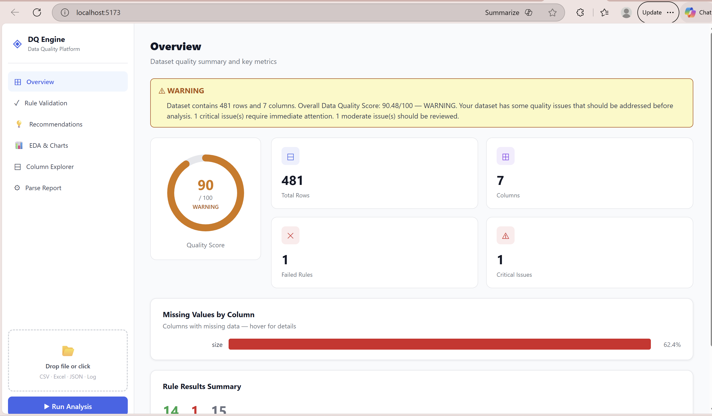
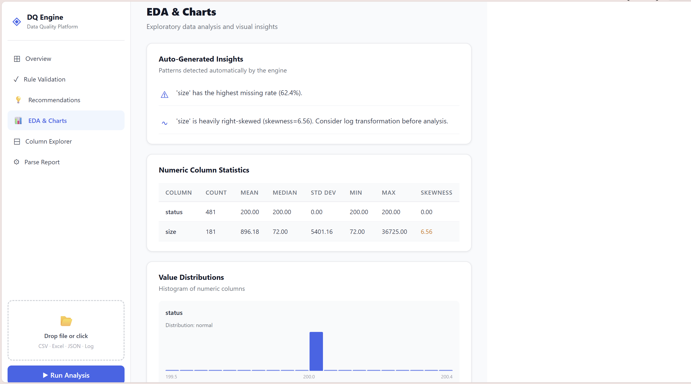
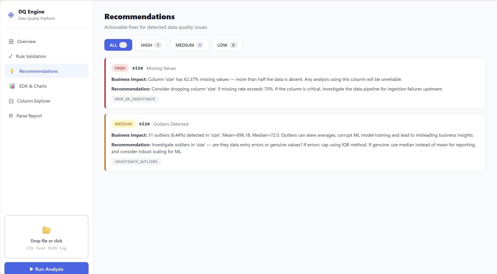
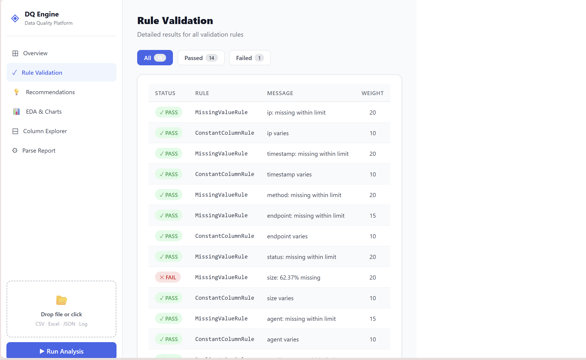

# ◈ Data Quality Engine

> Automated data quality profiling, validation, scoring and EDA — for any dataset, any format.


---

## The Problem

Organisations make critical decisions based on data — but most have no systematic way to verify data quality before analysis. Manual checking is slow, inconsistent and misses context. Enterprise tools like Informatica and Talend cost lakhs and require dedicated teams.

**The gap:** Small and mid-sized teams need automated, instant data quality assessment — without the complexity or cost.

> IBM estimates bad data costs the US economy **$3.1 trillion per year**. Poor data quality causes wrong inventory decisions, patient misdiagnoses, undetected fraud and failed ML models.

---

## What This Does

Upload any dataset — CSV, Excel, JSON, or log file — or connect directly to a SQLite/PostgreSQL database, and get an instant, comprehensive quality report in seconds.

The engine automatically:
- Detects file format, encoding and delimiter
- Profiles every column (missing values, distributions, types)
- Infers schema and semantic types (email, IP address, timestamp, HTTP status...)
- Generates and evaluates validation rules dynamically
- Scores the dataset from 0-100 with weighted rules
- Runs exploratory data analysis (correlations, outliers, distributions)
- Generates actionable, business-friendly recommendations
- Produces a natural language summary

---

## Architecture

```
data-quality-engine/
├── backend/
│   ├── main.py                  ← FastAPI server (5 endpoints)
│   └── dq_engine/
│       ├── smart_loader.py      ← Intelligent file parser
│       ├── profiler.py          ← Column-level statistics
│       ├── schema.py            ← Semantic type inference
│       ├── rule_factory.py      ← Dynamic rule generation
│       ├── rules.py             ← Rule implementations
│       ├── scorer.py            ← Weighted quality scoring
│       ├── eda.py               ← Exploratory data analysis
│       ├── recommendations.py   ← Actionable fix generator
│       ├── report.py            ← Report compilation
│       ├── pipeline.py          ← Main orchestration
│       └── sql_loader.py        ← SQLite / PostgreSQL connector
├── frontend/
│   └── src/
│       └── App.jsx              ← React dashboard
├── tests/                       ← 55 pytest tests
├── benchmark/                   ← accuracy, real-data, and comparison benchmarks
└── data/
    └── *.csv                    ← Sample datasets
```

### Pipeline Flow

```
File / SQL Table → Smart Loader → Profiler → Schema Detector
    → Rule Factory → Rule Evaluator → Scorer
    → EDA Analyzer → Recommendation Engine
    → Natural Language Summary → JSON Report → Dashboard
```

---

## Key Features

### Smart Loader
Automatically detects and handles any file format:
- **Format detection** — CSV, TSV, PSV, JSON (both standard arrays and line-delimited), Excel, Apache logs, Nginx logs, Syslog
- **Encoding detection** — uses `chardet` with fallback chain
- **Excel artifact handling** — strips outer quotes added by Excel when saving log files
- **Junk line filtering** — skips separators, comments, metadata headers
- **Large file handling** — intelligent sampling for files over 50MB (first/mid/last 10%)
- **Mid-file encoding errors** — replaces corrupted bytes with NaN, never silently drops rows
- **Data freshness check** — detects stale data using timestamp columns
- **Fallback chain** — if the primary parse strategy fails, retries with alternate delimiters and encodings rather than failing outright

### Dynamic Rule Engine
Rules are generated based on the schema and profile of each dataset — not hardcoded. Five rule types exist, and weights are semantic-type-aware rather than fixed:

| Rule | Applies to | Default weight | Notes |
|---|---|---|---|
| `MissingValueRule` | Every column | 20 | Rises to 30 for `id-like` columns, drops to 15 for `categorical` columns — missing data on an identifier is treated as more severe |
| `ConstantColumnRule` | Every column, except where constant is expected | 10 | Rises to 20 for `id-like` columns. Skipped entirely for columns whose semantic type is in an allow-list (`http_status`, `http_method`, `boolean`, `currency`, `country-code`, etc.) |
| `DuplicateRowRule` | Whole dataset | 15 | Fails above 5% duplicate rows |
| `ErrorRateRule` | Whole dataset | 10 | Only added for datasets with log metrics (log files) |
| `TrafficVolumeRule` | Whole dataset | 5 | Only added when the dataset has 100+ rows |

Rules are domain-aware — HTTP status columns being constant (all 200s) is not flagged as a data quality issue because it indicates a healthy server, not stale data. Outlier detection, correlation analysis, and distribution shape are also computed (see EDA Module below) but are reported informationally rather than folded into the pass/fail quality score.

### EDA Module
- Numeric summary (mean, median, std, IQR, skewness, kurtosis)
- Pearson correlation matrix with strong pair detection
- Distribution histograms with shape classification
- IQR-based outlier analysis with sample values
- Categorical frequency distribution with Shannon entropy
- Co-missing pattern detection
- Auto-generated insights in plain English

### Recommendations Engine
Every flagged issue comes with:
- **Severity** — HIGH / MEDIUM / LOW
- **Business impact** — plain English explanation of why it matters
- **Actionable fix** — specific pandas/SQL code suggestion
- **Action type** — IMPUTE / DROP_COLUMN / INVESTIGATE / REVIEW

---

## Tech Stack

| Layer | Technology |
|-------|-----------|
| Backend | Python 3.10, FastAPI, Uvicorn |
| Data Processing | Pandas, NumPy |
| File Parsing | chardet, csv.Sniffer, openpyxl |
| Database | SQLAlchemy, SQLite |
| Frontend | React 18, Recharts |
| API | REST, JSON, multipart/form-data |
| Testing | pytest, GitHub Actions CI |

---

## Setup

### Prerequisites
- Python 3.10+
- Node.js 18+

### Backend

```bash
git clone https://github.com/rareya/data-quality-engine.git
cd data-quality-engine

python -m venv venv
venv\Scripts\activate        # Windows
source venv/bin/activate     # macOS/Linux

pip install -r requirements.txt

uvicorn backend.main:app --reload
# Server runs at http://127.0.0.1:8000
```

### Frontend

```bash
cd frontend
npm install
npm run dev
# Dashboard runs at http://localhost:5173
```

### API Docs
```
http://127.0.0.1:8000/docs
```

---

## API Endpoints

| Method | Endpoint | Description |
|--------|----------|-------------|
| `POST` | `/analyze` | Upload file → full quality report |
| `POST` | `/analyze-sql` | Connect to a SQLite DB, analyze a table |
| `GET` | `/analyze-sql/tables` | List tables in a database |
| `GET` | `/demo` | Run on built-in demo dataset |
| `GET` | `/health` | Health check |

### Example: file upload

```bash
curl.exe -X POST http://127.0.0.1:8000/analyze -F "file=@your_data.csv"
```

### Example: direct SQL connection

```bash
curl.exe -X POST http://127.0.0.1:8000/analyze-sql -F "db_path=data/your.db" -F "table_name=your_table"
```

### Example Response

```json
{
  "rows": 194,
  "column_count": 8,
  "quality_score": {
    "score": 93.62,
    "status": "WARNING"
  },
  "summary": "Dataset contains 194 rows and 8 columns. Overall Data Quality Score: 93.62/100 — WARNING...",
  "failed_rules": [...],
  "recommendations": [...],
  "eda": {
    "numeric_summary": {...},
    "correlation_matrix": {...},
    "insights": [...]
  },
  "source": {
    "type": "sqlite",
    "db_path": "data/your.db",
    "table_name": "your_table"
  }
}
```

---

## Dashboard

The React frontend provides a 6-section dashboard:

- **Overview** — animated score gauge, stat cards, missing values chart, rule summary
- **Rule Validation** — filterable pass/fail table for all validation rules
- **Recommendations** — severity-filtered actionable fixes with business impact
- **EDA & Charts** — histograms, outlier analysis, correlations, categorical breakdowns
- **Column Explorer** — click any column to inspect its full statistical profile
- **Parse Report** — how the smart loader processed the file, encoding, freshness






---

## Testing

```bash
pytest tests/ -v
```

55 tests covering rule evaluation, scoring, schema detection, statistical profiling, the smart loader (including format detection and JSON parsing), and full end-to-end pipeline runs. Runs automatically on every push via GitHub Actions.

---

## Benchmarks

Three separate validations — "it runs without crashing," "it gives correct answers," and "it's useful on data nobody designed to be clean" are different claims, tested separately rather than assumed.

**1. Accuracy against known ground truth.** A synthetic dataset (2,040 rows) with deliberately injected, exactly-counted defects — 150 missing values, 40 duplicate rows, 1 constant column. The engine detected all three at 100% accuracy against the known counts.

**2. Validation against a real, independently-documented dataset.** The [UCI Online Retail dataset](https://archive.ics.uci.edu/ml/datasets/online+retail) (541,909 real transactions from a UK online retailer, cited in Chen, Sain & Guo, 2012, *Journal of Database Marketing and Customer Strategy Management*). This dataset's defects are already publicly documented elsewhere — ~24.9% missing `CustomerID`, ~0.27% missing `Description`, ~5,268 duplicate rows. The engine's output matched these independently-published figures.

**3. Comparison against Great Expectations**, on the same 541K-row dataset. This isn't presented as a clean win — the two tools weren't doing equivalent work, and the numbers reflect that honestly:

| Metric | Data Quality Engine | Great Expectations |
|---|---|---|
| Setup code required | 2 lines | 18 lines |
| Checks run | 18 | 11 |
| Runtime | 10.7s | 1.6s |

Great Expectations was faster because it only ran 11 basic null/range checks in this comparison. In the same run, this engine also computed a full EDA report (correlation matrix, entropy, outlier detection, skew/kurtosis) and generated natural-language recommendations — none of which Great Expectations does out of the box. The honest takeaway is "less setup for more output," not "faster." A stripped-down, EDA-skipping mode would likely close most of the runtime gap, but that's not what's shipped today.

---

## Bugs found and fixed during development

Documented here deliberately, rather than only in commit history:

- **Boolean-column profiling crash** — `pandas.api.types.is_numeric_dtype()` returns `True` for boolean columns (bool is a numeric subtype), which routed them into quantile-based numeric profiling and crashed on newer numpy versions. Fixed by checking `is_bool_dtype()` first and routing booleans to dedicated boolean profiling.
- **JSON array parsing gap** — the smart loader originally only supported JSON-lines format (one object per line) despite `.json` files most commonly being a single top-level array. Standard JSON arrays were silently misclassified as tabular data and failed to parse. Fixed by making `.json` extension detection authoritative and adding array/object parsing as the primary strategy.
- **Windows file-lock errors in the demo and SQL endpoints** — `tempfile.NamedTemporaryFile` holds an OS-level handle on Windows that isn't released the way it is on Linux/Mac, causing `PermissionError: [WinError 32]` both on database creation and later cleanup. Fixed by generating temp paths without opening a handle up front, and explicitly disposing the SQLAlchemy engine before cleanup.
- **Documentation ahead of implementation** — an earlier draft of this README listed five rule types (`OutlierRule`, `SchemaConsistencyRule`, `EmailFormatRule`, `IPAddressRule`, `TimestampConsistencyRule`) that were never actually implemented as scored rules. Outlier detection genuinely exists — it's computed in the EDA module and reported informationally — but doesn't affect the pass/fail quality score the way the original table implied. Fixed by rebuilding the rule table directly from `rules.py` source rather than from planning notes.

---

## Known limitations

- Log format detection uses fairly strict regex patterns (particularly for the Apache CSV format) — a log line with unexpected leading whitespace or an unusual field order will fall through to the generic custom-log parser.
- Header detection on tabular files uses a heuristic (numeric content in row 2 vs row 1) that can misfire on edge cases like ID columns that look numeric in both rows.
- Large-file intelligent sampling (first/middle/last 10%) is a reasonable heuristic for spotting quality drift, but it's still a sample — it won't catch a rare defect confined to a small slice of the untouched 70%.
- Semantic type detection for log-specific fields (`ip`, `status`, `timestamp`) is based on exact column name matches rather than content inference.

---

## Sample Datasets

| Dataset | Notes |
|---------|-------|
| `students.csv` | Small sample with missing values across multiple columns, correlated numeric fields |
| `ongc_access.csv` | Apache CSV log format, high missing rate in `size` column |

---

## Design Decisions

**Why not use Great Expectations or Talend?**
Enterprise tools require dedicated teams and cost lakhs. This engine is designed for any analyst to use immediately — no configuration, no infrastructure. See Benchmarks above for a direct, honest comparison rather than just the claim.

**Why generate rules dynamically?**
Hardcoded rules don't scale. Different datasets need different rules. The rule factory inspects the schema and profile of each dataset and generates appropriate rules automatically.

**Why is the smart loader needed?**
Real-world data is messy. Log files saved via Excel get extra quoting. Files have wrong encodings. Large files crash systems. The smart loader handles all of this transparently before the pipeline even starts.

**Why flag issues but not auto-fix them?**
The engine tells you WHAT is wrong. A data analyst decides WHY it matters and WHAT to do given the business context. Automation raises the floor — it doesn't replace judgment.

---

## Author

Built by Aarya Patankar — Data Analyst Intern Project @ONGC, 2026.

---

## License

MIT License — free to use, modify and distribute.